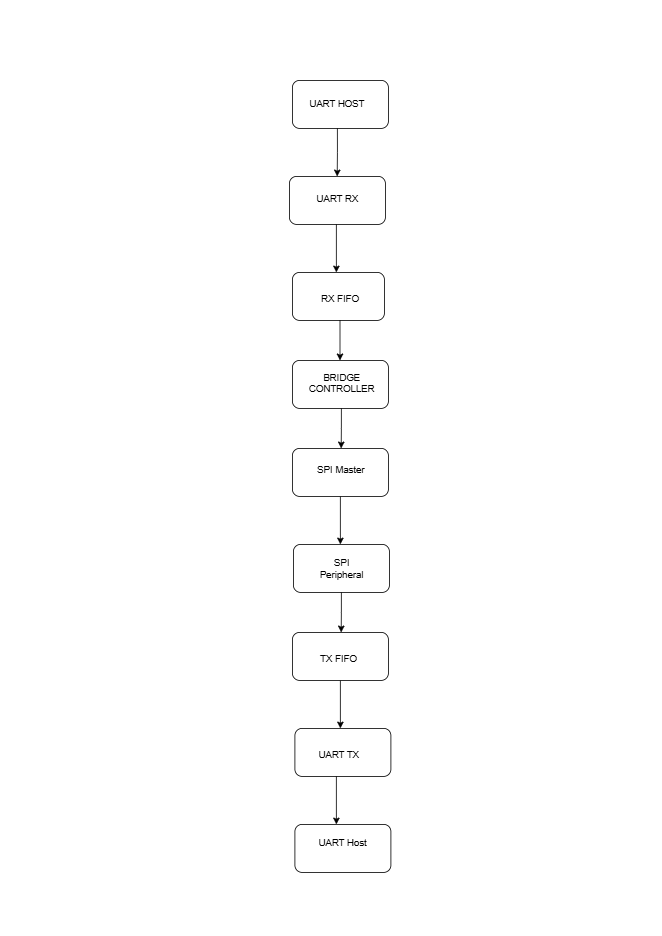

# UART to SPI Bridge

**Difficulty:** Intermediate

**Uses MCU:** Yes

**External Hardware:** UART host device and SPI peripheral.

## Overview

This project implements a UART to SPI bridge on the Shrike FPGA.

The module:

- Receives UART data
- Stores data in an RX FIFO
- Starts an SPI transaction
- Stores the SPI response in a TX FIFO
- Sends the response back through UART


## Compatibility

| Board                | Firmware                | Status               |
| -------------------- | ----------------------- | -------------------- |
| Shrike-Lite (RP2040) | `firmware/micropython/` | ✅ Tested |
| Shrike (RP2350)      | `firmware/arduino-ide/` | ⬜ Untested           |
| Shrike-fi (ESP32-S3) | `firmware/arduino-ide/` | ⬜ Untested           |

> FPGA bitstream is the same across all boards.

## Hardware Setup

The UART to SPI Bridge is designed to interface a UART-compatible host device with an SPI-compatible peripheral.

### UART Interface

Connect the UART host device to the FPGA UART pins.

| UART Device | FPGA GPIO   |
| ----------- | ----------- |
| TX          | GPIO14 (RX) |
| RX          | GPIO15 (TX) |
| GND         | GND         |

### SPI Interface

Connect the SPI peripheral to the FPGA SPI pins.

| SPI Device | FPGA GPIO     |
| ---------- | ------------- |
| MISO       | GPIO13 (MISO) |
| MOSI       | GPIO12 (MOSI) |
| SCLK       | GPIO10 (SCLK) |
| CS         | GPIO11 (CS)   |
| GND        | GND           |


### Development Setup

A Shrike-Lite (RP2040) board running MicroPython was used as the UART host during testing.

External loopback connection:

GPIO12 (MOSI) ↔ GPIO13 (MISO)

## Quick Start (Pre-Built Bitstream)

This example can be tested using the pre-built FPGA bitstream and the provided MicroPython firmware.

### FPGA

1. Connect your Shrike board to the computer.
2. Upload the bitstream from the `bitstream/` folder.
3. Reset the board after programming.

### Firmware

1. Open the MicroPython script located in:

   ```
   firmware/micropython/uart_to_spi_bridge.py
   ```

2. Upload and run the script on the development board.

### Expected Behavior

- Firmware sends 100 UART bytes
- FPGA starts an SPI transaction
- SPI response is sent back through UART

A successful run should complete the test without any communication errors.

## Build From Source

### FPGA (Verilog)

1. Open the FPGA project in Go Configure Software Hub (GCSH).
2. Add the Verilog source files from:

   ```
   ffpga/src/
   ```

3. Synthesize the design.
4. Generate the FPGA bitstream.
5. Program the Shrike board with the generated bitstream.

### MicroPython Firmware

1. Open the MicroPython script:

   ```
   firmware/micropython/uart_to_spi_bridge.py
   ```

2. Connect the development board.
3. Upload the script.
4. Run the program.

## How It Works

The UART to SPI Bridge receives UART data, transfers it through SPI, and sends the SPI response back through UART.



## Expected Output

When the project is running correctly, the MicroPython firmware sends 100 bytes to the FPGA over UART.

The FPGA transfers the data through the SPI interface and returns the received SPI data back through UART.

### Sample Serial Output

```text
UART-SPI LOOPBACK TEST
--------------------------------
Sending  : 0x00
Received : 0x00

Sending  : 0x01
Received : 0x01

Sending  : 0x02
Received : 0x02

...

Sending  : 0x63
Received : 0x63

--------------------------------
Test Complete
Errors = 0
PASS
```
The design was validated using an external SPI loopback connection between GPIO12 (MOSI) and GPIO13 (MISO), achieving 100 successful transfers with 0 errors.