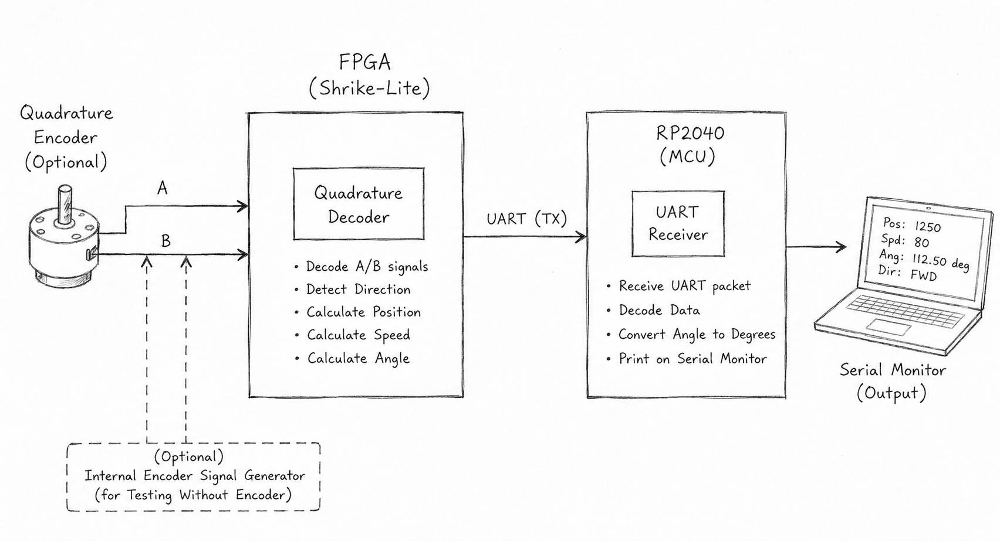
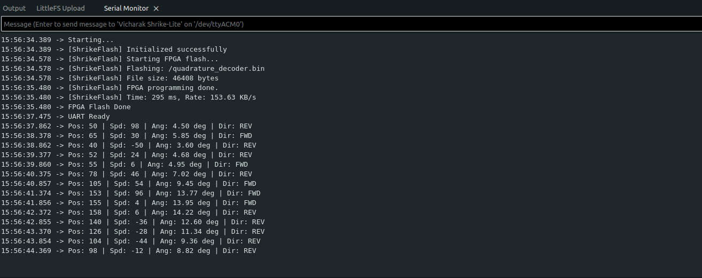

# quadrature_decoder

**Difficulty:** Intermediate

**Uses MCU:** Yes

**External Hardware:** Incremental Quadrature Encoder (Optional)

---

## Overview
A quadrature decoder is used to determine the `position`, `direction` and `speed` of rotational motion from incremental rotary encoders. Quadrature encoders generate two digital signals `(A and B)` that are phase shifted by 90 degrees. By observing the sequence of transitions between these two signals, the FPGA can identify whether the shaft is rotating in the forward or reverse direction while also counting encoder steps.

This project implements a fully digital quadrature decoder inside the FPGA on the Shrike-Lite board. The FPGA continuously monitors encoder transitions, updates the position count, calculates rotational speed over a configurable time window, and computes the angular position based on encoder counts per revolution (CPR). The processed data is packetized and transmitted to the RP2040 over UART, where it is decoded and displayed on the serial monitor.


#### The FPGA:

* Decodes quadrature encoder A/B signals
* Detects rotation direction
* Calculates position count
* Calculates rotational speed
* Tracks angular position
* Sends decoded data to RP2040 using UART packets

#### The RP2040 firmware:

* Receives UART packets from FPGA
* Decodes signed and unsigned data
* Converts encoder counts to degrees
* Prints readable logs over Serial Monitor

> The project also includes an optional internal encoder signal generator implemented on the RP2040 side. This allows users to test the FPGA design even without a physical rotary encoder connected to the board.
---

## Compatibility

| Board                | Firmware                | Status     |
| -------------------- | ----------------------- | ---------- |
| Shrike-Lite (RP2040) | `firmware/arduino-ide/` | ✅ Tested   |
| Shrike (RP2350)      | `firmware/arduino-ide/` | ⬜ Untested |
| Shrike-fi (ESP32-S3) | `firmware/arduino-ide/` | ⬜ Untested |

> FPGA bitstream is the same across all boards.

---

## Hardware Setup

### Block Diagram



---

## Pin Usage

### 1. External Encoder Connection

| FPGA Pin | Signal Name | Direction | Description               |
| -------- | ------------ | --------- | ------------------------- |
| F1       | enc_a        | Input     | Encoder Channel A         |
| F2       | enc_b        | Input     | Encoder Channel B         |
| F4       | uart_tx      | Output    | UART output from FPGA     |

---

### 2. MCU Interconnect

| Pin        | Signal Name | Direction | Description                     |
| ---------- | ------------ | --------- | ------------------------------- |
| GPIO1 | UART_RX      | input    | FPGA UART Tx to RP2040 UART RX  |

> GPIO4 (F4 - Tx) pin of FPGA is internally connected with GPIO(Rx) pin of RP2040 through UART. Make sure this mapping should be correct while defining. 

---

## Quick Start (Pre-Built Bitstream)

1. Connect encoder to FPGA inputs
2. Upload `bitstream/quadrature_decoder.bin` using ShrikeFlash
3. Upload Arduino firmware
4. Open Serial Monitor
5. Rotate encoder and observe logs over serial monitor

---

## Build From Source

### FPGA (Verilog)

1. Open project in Go Configure Software Hub
2. Add all Verilog modules
3. Configure parameters
4. Generate bitstream

### Firmware (Arduino)

1. Open `quadrature_decoder.ino`
2. Upload to RP2040
3. Open Serial Monitor

---

## How It Works

### FPGA Modules

### 1. `quad_dec`

Responsible for:

* Synchronizing encoder inputs
* Detecting quadrature transitions
* Determining rotation direction
* Updating position count
* Calculating rotational speed
* Tracking angular count

---

### 2. `uart_tx`

Responsible for:

* UART serial transmission
* Sending bytes serially (LSB first)
* Generating UART start and stop bits

---

### 3. `uart_packetizer`

Responsible for:

* Packing FPGA data into UART frames
* Sending:
  * Position
  * Speed
  * Angle
  * Direction

Packet format:

```text
[AA][pos MSB][pos LSB][spd MSB][spd LSB][ang MSB][ang LSB][dir]
```

Direction encoding:

```text
dir[0] = 1 → Forward
dir[0] = 0 → Reverse
```

---

### 4. `top`

Top-level integration module that:

* Instantiates:
  * `quad_dec`
  * `uart_tx`
  * `uart_packetizer`
* Connects encoder inputs
* Routes UART output
* Interfaces FPGA with RP2040

---

## Features

* Full quadrature decoding
* Direction detection
* Signed position tracking
* Signed speed calculation
* Angle calculation using CPR
* UART packet communication
* Configurable update interval
* Optional internal encoder signal generator
* Works without physical encoder for testing

---

## UART Packet Format

The FPGA sends UART packets in the following format:

| Byte Index | Data         | Description         |
| ----------- | ------------ | ------------------- |
| 0           | `0xAA`       | Header              |
| 1           | Position MSB | Signed position     |
| 2           | Position LSB | Signed position     |
| 3           | Speed MSB    | Signed speed        |
| 4           | Speed LSB    | Signed speed        |
| 5           | Angle MSB    | Encoder angle count |
| 6           | Angle LSB    | Encoder angle count |
| 7           | Direction    | `1=FWD`, `0=REV`    |

---

## Position, Speed and Angle Explanation

### Position

Position represents the accumulated encoder counts.

* Forward rotation increases count
* Reverse rotation decreases count

Example:

```text
0 → 1 → 2 → 3 → ...
```

Reverse:

```text
3 → 2 → 1 → 0 → -1 ...
```

Position is stored as signed 16-bit data.

---

### Speed

Speed is calculated based on encoder steps detected within a configurable update window.

Units:

```text
counts/sec
```

Examples:

| Speed Value | Meaning            |
| ------------ | ------------------ |
| `+10`        | Forward rotation   |
| `-10`        | Reverse rotation   |
| `0`          | Encoder stopped/ Same position    |

---

### Angle

Angle is derived using encoder CPR (Counts Per Revolution).

Formula:

```text
Angle (degrees) = (encoder_count × 360) / CPR
```

For this project:

```text
CPR = 4000
```

Meaning:

* 4000 counts = 360°
* 2000 counts = 180°
* 1000 counts = 90°

---

## Top Module Interface

| Signal     | Direction | Description           |
| ----------- | --------- | --------------------- |
| `clk`      | In        | System clock (50 MHz) |
| `enc_a`    | In        | Encoder channel A     |
| `enc_b`    | In        | Encoder channel B     |
| `uart_tx`  | Out       | UART transmit output  |
| `uart_tx_en`  | Out       | Always High  |
| `clk_en`  | Out       | Always High  |

---

## Parameters Used

### `WIDTH`

```verilog
parameter WIDTH = 16
```

Bit width for position, speed and angle.

---

### `CLK_FREQ`

```verilog
parameter CLK_FREQ = 50_000_000
```

System clock frequency.

---

### `UPDATE_MS`

```verilog
parameter UPDATE_MS = 500
```

Speed update interval in milliseconds.

---

### `CPR`

```verilog
parameter CPR = 4000
```

Counts per revolution.

For quadrature decoding:

```text
CPR = Encoder_PPR × 4
```

Example:

```text
1000 PPR encoder → 4000 CPR
```

---

## Firmware Overview

### `quadrature_decoder.ino`

Responsible for:

* Flashing FPGA bitstream
* Receiving UART packets
* Decoding signed/unsigned data
* Converting counts to degrees
* Printing readable serial logs

---

## Internal Encoder Test Mode

The firmware supports optional internal encoder signal generation.

Enable:

```cpp
#define USE_INTERNAL_ENCODER_TEST 1
```

Disable:

```cpp
#define USE_INTERNAL_ENCODER_TEST 0
```

When enabled:

* RP2040 GPIO17 → Encoder A
* RP2040 GPIO18 → Encoder B

The firmware generates quadrature patterns automatically.

---

## Quadrature Patterns

### Forward Rotation

```text
00 → 01 → 11 → 10 → repeat
```

### Reverse Rotation

```text
00 → 10 → 11 → 01 → repeat
```

The FPGA determines direction by observing transition order.

---

## Quick Steps (Arduino IDE)

1. Connect Shrike board via USB
2. Open Arduino IDE
3. Open `quadrature_decoder.ino`
4. Copy FPGA bitstream into `data/`
5. Upload filesystem using LittleFS uploader
6. Upload Arduino sketch
7. Open Serial Monitor at `115200`
8. Rotate encoder and observe logs

---

## Output over Serial Monitor

* Position changes continuously with rotation
* Speed indicates movement direction and rate
* Angle tracks shaft position
* Direction displays Forward/Reverse




---

## Notes

* UART transmission uses:
  * 115200 baud
  * 8 data bits
  * No parity
  * 1 stop bit

* FPGA sends UART bits LSB first internally
* Packet bytes are transmitted MSB first

* Position and speed are signed values
* Angle is unsigned


  ---

  ## References

* [Incremental Encoder - Wikipedia](https://en.wikipedia.org/wiki/Incremental_encoder)

* [Infineon Quadrature Decoder Documentation](https://www.infineon.com/assets/row/public/documents/cross-divisions/396/infineon-quadrature-decoder-quaddec-component-quaddec-v2.30-software-module-datasheets-en.pdf?fileId=8ac78c8c7d0d8da4017d0e96917b206e&utm_source=cypress&utm_medium=referral&utm_campaign=202110_globe_en_all_integration-files)

* [FPGA4Fun - Quadrature Decoder](https://www.fpga4fun.com/QuadratureDecoder.html)

* [ Shrike pinouts]( https://github.com/vicharak-in/shrike/blob/main/docs/shrike_pinouts.md
)

