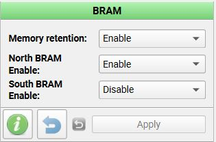
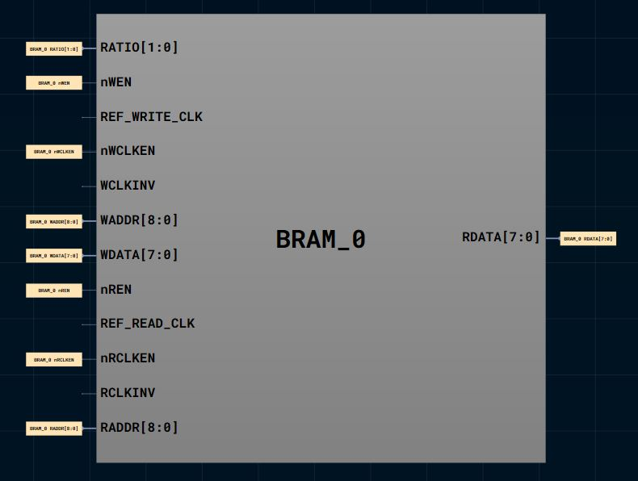

# stack_processor_spi

**Difficulty:** Advanced

**Uses MCU:** Yes

**External Hardware:** None

## Overview

This project implements a small stack-based processor written in Verilog HDL, designed to run on FPGA of Shrike and be controlled by onboard RP2040 through a Serial Peripheral Interface (SPI).

Instead of using a conventional register-file–centric architecture, the processor relies on a Last-In, First-Out (LIFO) stack as its primary data storage and execution mechanism. The stack itself is implemented using on-chip Block RAM (BRAM), allowing efficient and deterministic push and pop operations.

All instructions are issued to the processor over SPI, where each received byte is decoded as a command that either manipulates the stack, transfers data between the stack and internal registers, or performs arithmetic and logic operations.

---

## Compatibility

| Board                | Firmware                | Status     |
| -------------------- | ----------------------- | ---------- |
| Shrike-Lite (RP2040) | `firmware/micropython/` | ✅ Tested   |
| Shrike (RP2350)      | `firmware/micropython/` | ✅ Tested   |
| Shrike-fi (ESP32-S3) | `firmware/micropython/` | ⬜ Untested |

> FPGA bitstream is the same across all boards.

---

## Hardware Setup

No external hardware required.

---

## System Architecture

The processor exposes a simple instruction set over SPI that allows:

* Pushing 4-bit values onto a stack
* Popping values from the stack
* Loading internal registers from the stack
* Performing arithmetic and logic operations
* Reading stack status and data via SPI

### Internal Registers

* A
* B
* C

Most arithmetic and logic operations:

* Use **A and B as operands**
* Store result in **C**

---

## Modules

### 1. `top`

* SPI interface
* Instruction decode
* Stack control
* Register management

### 2. `spi_target`

* SPI slave implementation
* Configuration:

  * CPOL = 0
  * CPHA = 0
  * 8-bit transfer
  * MSB first

### 3. `lifo_bram`

* BRAM-backed stack
* Features:

  * Push (`WE`) / Pop (`RE`)
  * Empty / Full flags
  * 4-bit data width
  * Synchronous operation

---

## BRAM Timing Note

> The write operation in BRAM takes 1 cycle. The data is written in BRAM on the rising clock of 2nd cycle.
> The read operation in BRAM takes 2 cycles. The output data is valid in the 2nd cycle.

---

## LIFO BRAM Module Interface

| Signal                  | Direction | Description                   |
| ----------------------- | --------- | ----------------------------- |
| `clk`                   | In        | System clock (50 MHz typical) |
| `nReset`                | In        | Active-low reset              |
| `DIN[3:0]`              | In        | Data input (push)             |
| `WE`                    | In        | Write enable                  |
| `RE`                    | In        | Read enable                   |
| `DOUT[3:0]`             | Out       | Data output (pop)             |
| `LIFO_full`             | Out       | Stack full                    |
| `LIFO_empty`            | Out       | Stack empty                   |
| `BRAM0_RATIO[1:0]`      | Out       | Fixed to `2'b00`              |
| `BRAM0_DATA_IN[7:0]`    | Out       | Data to BRAM                  |
| `BRAM0_WEN`             | Out       | Active-low write enable       |
| `BRAM0_WCLKEN`          | Out       | Write clock enable            |
| `BRAM0_WRITE_ADDR[8:0]` | Out       | Write address                 |
| `BRAM0_DATA_OUT[3:0]`   | In        | Data from BRAM                |
| `BRAM0_REN`             | Out       | Active-low read enable        |
| `BRAM0_RCLKEN`          | Out       | Read clock enable             |
| `BRAM0_READ_ADDR[8:0]`  | Out       | Read address                  |

---

## BRAM Configuration

**Enable BRAM (North BRAM only)**



---

## BRAM0 Floorplan



For more information:

* [Datasheet](https://www.renesas.com/en/document/dst/slg47910-datasheet?r=25546631)
* [FIFO BRAM Example](https://www.renesas.com/en/document/apn/fg-011-fifo-using-bram?srsltid=AfmBOorkxiMLFTFX1kxDsPZrO7USStJ2QL_vjj5_Dv_yuWuQguJm1SbN)

---

## Top Module Interface

| Signal      | Direction | Description             |
| ----------- | --------- | ----------------------- |
| `clk`       | In        | System clock (50 MHz)   |
| `rst_n`     | In        | Reset (active low)      |
| `spi_ss_n`  | In        | Chip select             |
| `spi_sck`   | In        | SPI clock               |
| `spi_mosi`  | In        | Input from controller   |
| `spi_miso`  | Out       | Output to controller    |
| + BRAM Pins | -         | Internal BRAM interface |

---

## Pin Usage for Testing

### FPGA

| FPGA GPIO Pin | Signal   | Direction | Description |
| ------------- | -------- | --------- | ----------- |
| 3             | spi_sck  | Input     | SPI clock   |
| 4             | spi_ss_n | Input     | Chip select |
| 5             | spi_mosi | Input     | MOSI        |
| 6             | spi_miso | Output    | MISO        |
| 18            | rst_n    | Input     | Reset       |

---

### RP2040

| RP2040 Pin | Signal | Direction | Description   |
| ---------- | ------ | --------- | ------------- |
| 2          | SCK    | Output    | SPI clock     |
| 1          | CS     | Output    | Chip select   |
| 3          | MOSI   | Output    | Master output |
| 0          | MISO   | Input     | Master input  |
| 14         | Reset  | Output    | Reset         |

---

## Quick Start (Pre-Built Bitstream)

1. Connect Shrike board via USB
2. Upload bitstream using ShrikeFlash
3. Run `multiplication.py` on RP2040
4. Observe SPI responses

---

## Build From Source

### FPGA (Verilog)

1. Open project in Go Configure Software Hub
2. Add modules:

   * `top`
   * `spi_target`
   * `lifo_bram`
3. Configure BRAM + I/O
4. Generate bitstream

### Firmware (MicroPython)

1. Use SPI to send instruction bytes
2. Observe returned values

---

## Instruction Set

| Opcode    | Function                 |
| --------- | ------------------------ |
| 0000_0000 | Stall                    |
| 0001_XXXX | Push (4-bit data)        |
| 0010_0000 | Pop                      |
| 0011_0000 | Push reg A               |
| 0011_0001 | Push reg B               |
| 0011_0010 | Push reg C               |
| 0011_0011 | Pop reg A                |
| 0011_0100 | Pop reg B                |
| 0011_0101 | Pop reg C                |
| 1100_0000 | Add (C = A + B)          |
| 1100_0001 | Sub (C = A - B)          |
| 1100_0010 | Mul (C = A * B)          |
| 1100_0011 | Div (C = A / B)          |
| 1100_0100 | Shift Left               |
| 1100_0101 | Shift Right (logical)    |
| 1100_0110 | Shift Right (arithmetic) |

---

## SPI Communication Example (Multiplication)

### Input

```text id="stk1"
0x12  # Push 2
0x15  # Push 5
0x33  # Pop A
0x34  # Pop B
0xC2  # Multiply (C = A * B)
0x32  # Push C
0x20  # Pop
0x00  # Stall
```

### Output

```text id="stk2"
Sent 0x12, Received 0x00
Sent 0x15, Received 0x00
Sent 0x33, Received 0x00
Sent 0x34, Received 0x00
Sent 0xC2, Received 0x00
Sent 0x32, Received 0x00
Sent 0x20, Received 0x00
Sent 0x00, Received 0x8A
```

* `8` → stack empty flag
* `A` → result

---

## Expected Output

* Stack operations execute correctly
* Arithmetic operations produce valid results
* SPI returns status + computed data

---

## Notes

* Stack is BRAM-backed → deterministic timing

* SPI acts as control + debug interface

* Instruction set is easily extendable

* Based on provided design 
