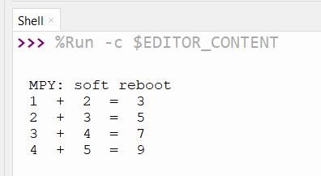

# uart_alu

**Difficulty:** Intermediate

**Uses MCU:** Yes

**External Hardware:** None

## Overview

This project demonstrates UART-based communication between an RP2040 and an FPGA. Two 8-bit numbers are sent from the RP2040 to the FPGA over UART. The FPGA stores the received values, performs an addition operation, and then transmits the result back to the RP2040 using UART.

## Compatibility

| Board                | Firmware                | Status        |
| -------------------- | ----------------------- | ------------- |
| Shrike-Lite (RP2040) | `firmware/micropython/` | ✅ Tested     |
| Shrike (RP2350)      | `firmware/micropython/` | ✅ Tested     |
| Shrike-fi (ESP32-S3) | `firmware/micropython/` | ⬜ Untested   |

> FPGA bitstream is the same across all boards.

## Hardware Setup

No external hardware required.

### FPGA Connections

| FPGA GPIO Pin | Signal Name | Direction | Description            |
| ------------- | ----------- | --------- | ---------------------- |
| 3             | Reset       | Input     | Reset signal           |
| 4             | UART TX     | Output    | UART output to RP2040  |
| 6             | UART RX     | Input     | UART input from RP2040 |

### RP2040 Connections

| RP2040 Pin | Signal Name | Direction | Description          |
| ---------- | ----------- | --------- | -------------------- |
| 1          | UART RX     | Input     | UART input from FPGA |
| 0          | UART TX     | Output    | UART output to FPGA  |
| 2          | Reset       | Output    | Reset signal to FPGA |

> Ensure pin mapping in FPGA constraints matches firmware configuration.

---

## Quick Start (Pre-Built Bitstream)

1. Connect Shrike board via USB
2. Upload `bitstream/uart_alu.bin` using ShrikeFlash
3. Run `uart_sum.py` on RP2040
4. Expected result:

   * Two numbers are sent to FPGA
   * FPGA computes sum
   * Result is returned via UART

---

## Build From Source

### FPGA (Verilog)

1. Open project in Go Configure Software Hub
2. Add modules: `top`, `uart_rx`, `uart_tx`
3. Configure I/O mapping
4. Generate bitstream

### Firmware (MicroPython)

1. Open `uart_sum.py` in Thonny
2. Configure UART pins and baud rate
3. Run script

---

## How It Works

The design consists of three modules:

### 1. `top` Module

* Implements FSM
* Continuously monitors UART input
* Stores two 8-bit values
* Performs addition
* Triggers transmission of result

### 2. `uart_rx` Module

* Receives UART data
* Asserts "data valid" signal when byte is received

### 3. `uart_tx` Module

* Transmits data over UART
* Sends result when triggered

---

## Top Module Interface

| Signal   | Direction | Description                   |
| -------- | --------- | ----------------------------- |
| `clk`    | In        | System clock (50 MHz typical) |
| `rst`    | In        | Reset signal                  |
| `rx`     | In        | UART receiver line            |
| `tx`     | Out       | UART transmitter line         |
| `tx_en`  | Out       | Output enable (always 1)      |
| `clk_en` | Out       | Clock enable (always 1)       |

---

## Parameters Used

### `CLK`

* System clock frequency

```
parameter CLK = 50_000_000
```

### `BAUD_RATE`

* UART communication baud rate

```
parameter BAUD_RATE = 115200
```

---

## Expected Output

The result of adding two 8-bit numbers is received back on the RP2040 via UART.

### Output in Thonny



---

## Notes

* Ensure correct baud rate configuration on both FPGA and RP2040
* Reset must be handled properly before communication
* UART communication is byte-based and sequential
