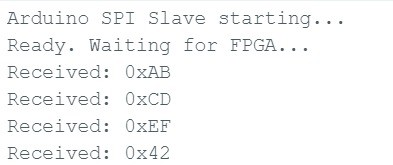
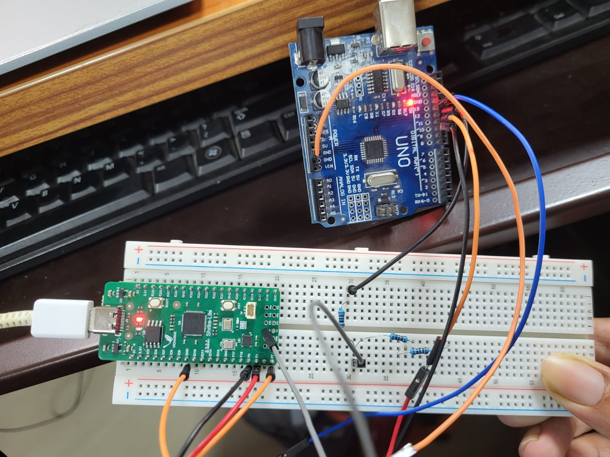

# usb_to_spi

**Difficulty:** Intermediate

**Uses MCU:** Yes

**External Hardware:** Arduino Uno (external SPI slave)

## Overview

This example turns the Shrike board into a **USB-to-SPI bridge**. Bytes typed on
the PC travel over USB to the RP2040, which forwards them over SPI to the FPGA.
The FPGA receives each byte as an SPI *target*, then re-transmits it as an SPI
*master* on a second set of GPIO pins to an external SPI slave (an Arduino Uno).
The slave's reply travels back through the same path to the PC.

You will learn how to bridge two SPI buses inside the FPGA: acting as a **slave**
to the RP2040 on the fixed programming link, and as a **master** to an external
device on free GPIOs.

## Compatibility

| Board                | Firmware                | Status     |
| -------------------- | ----------------------- | ---------- |
| Shrike-Lite (RP2040) | `firmware/micropython/` | ✅ Tested  |
| Shrike (RP2350)      | `firmware/micropython/` | ⚪ Untested |
| Shrike-fi (ESP32-S3) | `firmware/micropython/` | ⚪ Untested |

> FPGA bitstream is the same across all boards.

## Hardware Setup

An Arduino Uno is used as the external SPI slave. The Uno is a 5 V device, so the
FPGA's `m_miso` input must be level-shifted from 5 V down to 3.3 V.

### FPGA Connections (link to RP2040 — FPGA is slave)

| FPGA GPIO Pin | Signal Name | Direction | Description              |
| ------------- | ----------- | --------- | ------------------------ |
| 3             | `spi_sck`   | Input     | SPI clock                |
| 4             | `spi_ss_n`  | Input     | Chip select (active low) |
| 5             | `spi_mosi`  | Input     | MOSI (receive)           |
| 6             | `spi_miso`  | Output    | MISO (transmit)          |
| 16            | `led`       | Output    | LED (shows last byte)    |

### FPGA Connections (link to Arduino — FPGA is master)
Here, GPIO8 is a PMOD Connector Pin.
| FPGA GPIO Pin | Signal Name | Direction | Description                  |
| ------------- | ----------- | --------- | ---------------------------- |
| 0             | `m_sck`     | Output    | SPI clock to slave           |
| 1             | `m_mosi`    | Output    | Master output to slave       |
| 7             | `m_ss_n`    | Output    | Chip select (active low)     |
| 8             | `m_miso`    | Input     | Master input (via divider)   |

### RP2040 Connections

| RP2040 Pin | Signal Name | Direction | Description   |
| ---------- | ----------- | --------- | ------------- |
| 2          | SCK         | Output    | SPI clock     |
| 1          | CS          | Output    | Chip select   |
| 3          | MOSI        | Output    | Master output |
| 0          | MISO        | Input     | Master input  |

### Arduino Uno Connections (external slave)

| Arduino Pin | Signal Name | Direction | Connects to FPGA          |
| ----------- | ----------- | --------- | ------------------------- |
| D13         | SCK         | Input     | `m_sck` (GPIO 0)          |
| D11         | MOSI        | Input     | `m_mosi` (GPIO 1)         |
| D12         | MISO        | Output    | `m_miso` (GPIO 8, divider) |
| D10         | SS          | Input     | `m_ss_n` (GPIO 7)         |
| GND         | GND         | —         | Common ground             |

### Level Shifting

The Arduino Uno drives MISO at 5 V. Use a resistor divider (e.g. 1.8 kΩ / 3.3 kΩ)
on D12 before it reaches the FPGA `m_miso` pin (GPIO 8) to keep it at 3.3 V.
The FPGA outputs (`m_sck`, `m_mosi`, `m_ss_n`) at 3.3 V are read fine by the Uno.

## Quick Start (Pre-Built Bitstream)

1. Connect the Shrike board via USB.
2. Upload `bitstream/usb_to_spi.bin` to the board using ShrikeFlash.
3. Open `firmware/arduino-ide/usb_to_spi.ino` in the Arduino IDE and upload it to
   the Uno, then open its Serial Monitor at 115200 baud.
4. Open `firmware/micropython/usb_to_spi.py` in Thonny and run it on the RP2040.
5. On the PC, run `firmware/micropython/host.py` (set `PORT` to the RP2040's COM
   port first).
6. Expected result: the bytes sent from the PC appear on the Arduino Serial
   Monitor, confirming the FPGA mastered the SPI bus to the external slave.

> No Arduino on hand? Jumper FPGA GPIO 1 (`m_mosi`) to GPIO 8 (`m_miso`) and run
> `firmware/micropython/loopback_test.py` to verify the master path by loopback.

## Build From Source

### FPGA (Verilog)

1. Open the project in Go Configure Software Hub.
2. Add `top.v`, `spi_target.v`, and `spi_master.v` from `ffpga/src/`.
3. Configure the I/O mapping as listed in the tables above.
4. Generate the bitstream.

### Firmware (MicroPython + Arduino)

1. Open `firmware/micropython/usb_to_spi.py` in Thonny, adjust the pins in
   `CONFIG` if needed, and run it.
2. Open `firmware/arduino-ide/usb_to_spi.ino` in the Arduino IDE and upload it to
   the Uno.

## How It Works

The data path is: **PC USB → RP2040 (SPI master) → FPGA → external slave**, with
the reply returning along the same route. The FPGA forwards each byte and returns
the slave's previous reply, so responses are one transfer behind (send a trailing
dummy byte to flush the last reply).

### 1. `top` Module

* Instantiates `spi_target` (slave to the RP2040) and `spi_master` (master to the
  external slave).
* On each received byte, starts a master transfer to forward it and latches the
  slave's reply to return on the next transfer.
* Generates an internal power-on reset (no external reset pin).
* Mirrors the low bit of the last byte on the LED.

### 2. `spi_target` Module

* Implements the SPI slave: receives on `spi_mosi`, transmits on `spi_miso`.
* Synchronizes `spi_sck` and `spi_ss_n` into the system clock domain.
* Strobes `o_rx_data_valid` for one cycle per received byte.

### 3. `spi_master` Module

* Implements the SPI master: generates `m_sck`, `m_ss_n`, and `m_mosi`.
* Samples a synchronized `m_miso` (2-flop synchronizer) for reliable reads.
* `CLK_DIV` sets the SCK rate from the system clock.

## Top Module Interface

| Signal       | Direction | Description                       |
| ------------ | --------- | --------------------------------- |
| `clk`        | In        | System clock (internal oscillator) |
| `clk_en`     | Out       | Clock enable (always 1)           |
| `spi_ss_n`   | In        | SPI select from RP2040 (active low) |
| `spi_sck`    | In        | SPI clock from RP2040             |
| `spi_mosi`   | In        | Input from RP2040                 |
| `spi_miso`   | Out       | Output to RP2040                  |
| `m_ss_n`     | Out       | Chip select to external slave     |
| `m_sck`      | Out       | SPI clock to external slave       |
| `m_mosi`     | Out       | Output to external slave          |
| `m_miso`     | In        | Input from external slave         |
| `led`        | Out       | LED output                        |

## Expected Output

* Bytes sent from the PC appear on the Arduino Serial Monitor as `Received: 0xNN`.
  This is the observed result and confirms the path PC → RP2040 → FPGA → Arduino,
  with the FPGA acting as SPI master.
* The Arduino also echoes each byte back on MISO. By design this reply propagates
  back through the FPGA to the RP2040 and on to the PC, one transfer behind. The
  return path is demonstrated separately by the `loopback_test.py` jumper test.

This confirms:

* The RP2040 ↔ FPGA SPI link works (FPGA as slave).
* The FPGA ↔ Arduino SPI link works (FPGA as master) — seen on the Serial Monitor.

## Notes

* SPI operates in full-duplex mode (simultaneous read/write).
* The bridge is store-and-forward, so replies are one transfer behind.
* The Arduino Uno is 5 V — level-shift the MISO line into the 3.3 V FPGA.
